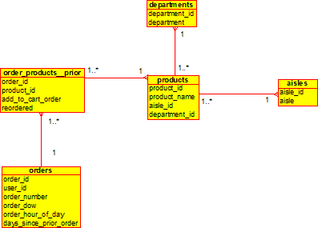
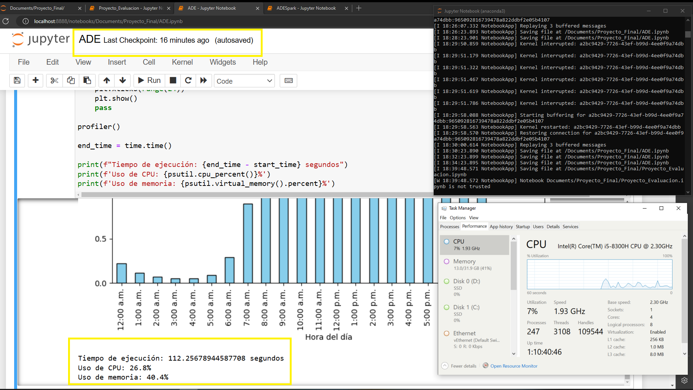
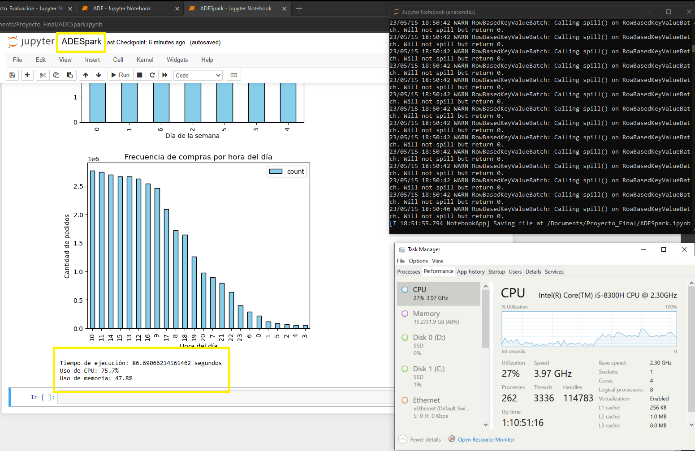
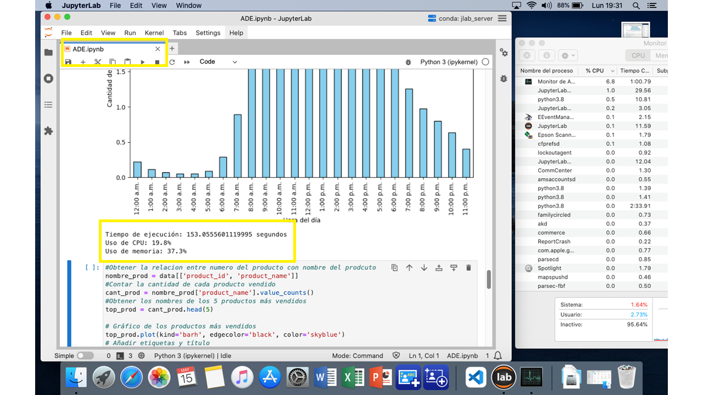
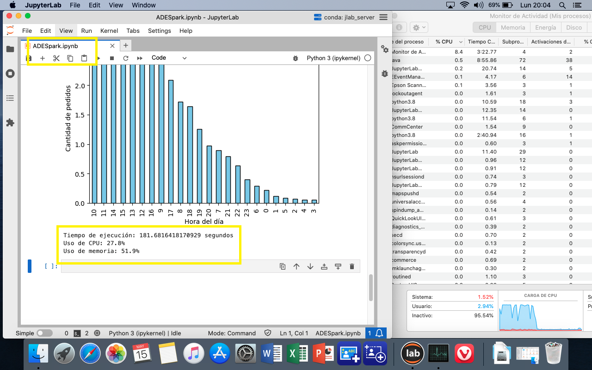
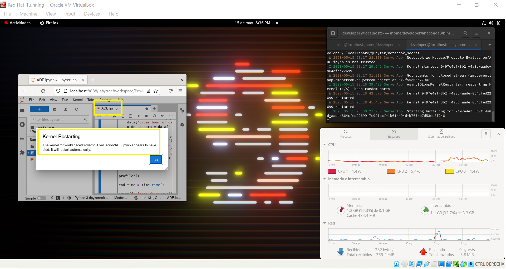
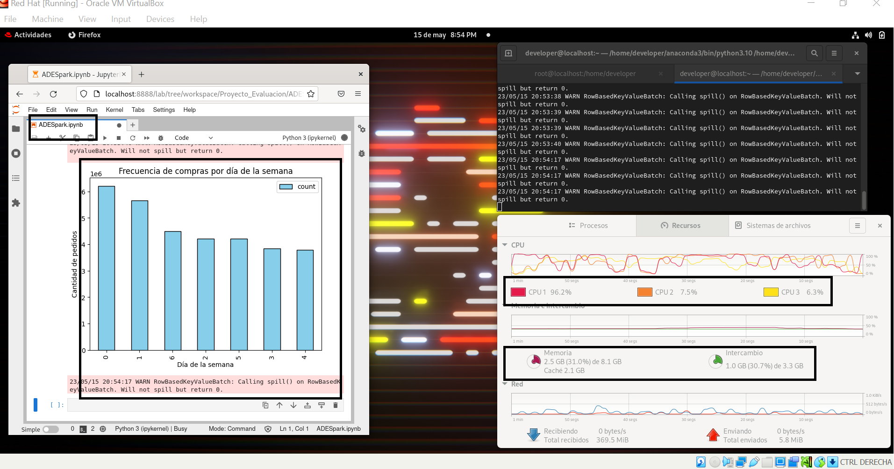
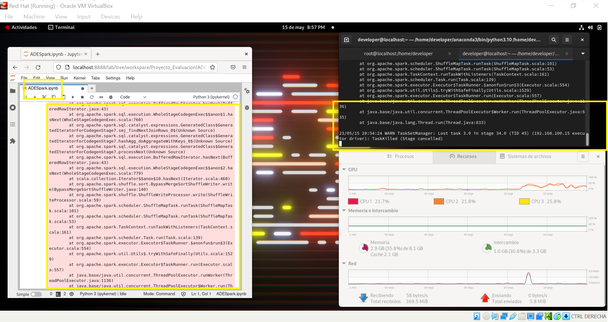

# Improve business strategy and increase profitability

---


---

## Author: Juan Carlos González
## E-mail: jcgi.laboral@gmail.com

---

## Date: May, 2024

---

## Content

1. Objective
2. Description of the data
3. Exploratory analysis
4. Development
5. Results
6. Conclusion
7. References

---

# 1. Project Objective
The objective is to analyze the data and obtain valuable information that allows the company to improve its sales strategy and increase its profitability.

# 2. Description of the data

This project has an Instacart Market Basket Analysis dataset, which is contained in several CSV files. 

<small> The information contained in the CSV files is as follows:

• **orders.csv** : Contains information on orders placed by users.
Each row represents an order and contains the following information:
- **order_id** : Order ID.
- **user_id** : ID of the user who placed the order.
- **order_number**: Order number for each user (1 = first order, 2 =
second order, etc.).
- **order_dow** : Day of the week the order was placed.
- **order_hour_of_day** : Time of day the order was placed.
- **days_since_prior_order** : Days elapsed since the last order of the
user.

• **order_products__prior.csv**: Contains information on products purchased from
every order. Each row represents a product in an order and contains the
following information:
- **order_id** : Order ID.
- **product_id** : ID of the purchased product.
- **add_to_cart_order** : Order in which the product was added to the cart in the
time of order.
- **reordered** : Indicates whether the product has been ordered by the user
formerly.

• **products.csv** : Contains information about the products sold in the store. Every
row represents a product and contains the following information:
- **product_id** : Product ID.
- **product_name** : Name of the product.
- **aisle_id**: ID of the aisle where the product is located.
- **department_id** : ID of the department to which the product belongs.

• **aisles.csv** : Contains information from the store aisles. Each row represents
a hallway and contains the following information:
- **aisle_id** : Hallway ID.
- **aisle** : Name of the corridor.

• **departments.csv** : Contains information about the store's departments. Every
Row represents a department and contains the following information:
- **department_id** : Department ID.
- **department** : Name of the department.    

</small>

Entity Relationship Diagram
<p>

</p>

# 3. Exploratory analysis

In exploratory analysis files are analyzed with the information provided in the previous section, the purpose is to analyze and investigate the datasets, summarize their main characteristics, detect anomalies, identify relationships, eliminate irrelevant variables, impute missing values, and clean up product names.

The tasks to be carried out are defined: 

1. Perform exploratory analysis of the data to understand the distribution of orders, the number of products per order, and the frequency of purchases per day and hour. 
2. Identify the best-selling products in the store and visualize the results using a bar graph. 
3. Identify the most purchased products in each department and visualize the results using a bar graph. 
4. Identify the products that are most purchased together, i.e. those that appear in the same orders most frequently, and visualize the results using a network graph. 

Based on the tasks defined and the exploratory analysis, the following actions will be carried out:

- **Do not use the isolated table**.

- Remove the following attributes:
- - **eval_set** in the **orders** table: This attribute indicates which dataset (training, test, etc.) each order belongs to, but is not used in this analysis.
- - **days_since_prior_order** in the **orders** table: This attribute indicates how many days have passed since the last order of the same user, but is not used in this analysis.
- - **aisolate** from the **products** table: This attribute indicates the aisle in which each product is located, but is not used in this analysis.
- - **reordered** in the **order_products** table: This attribute indicates whether the product was reordered by the same user, but is not used in this analysis.

- Impute missing values and clean up product names.

- Blank spaces after the product name will be removed.

- The product name is going to be converted to lowercase.

# 4. Development

For the development, each task will be worked on as follows:
1. Pre-process the data by removing irrelevant variables, imputing missing values, and cleaning up product names.
2. Perform an exploratory analysis of the data to understand the distribution of orders.
- Display of the number of products per order
- Display frequency of purchases per day
- Display frequency of purchases per hour.
3. Identify the best-selling products in the store and visualize the results using a bar chart.
4. Identify the most purchased products in each department and visualize the results using a bar graph.
5. Identify the products that are most purchased together, i.e. those that appear in the same orders most frequently, and visualize the results using a network graph.

## 4.1. Pre-process data by removing irrelevant variables, imputing missing values, and clearing product names.

- Install and Import Modules

```python
!pip install pandas
!pip install matplotlib
!pip install networkx
#Importar módulos
#Modulo para procesamiento de datos
import pandas as pd
#Modulo para visualizacion de datos
import matplotlib.pyplot as plt
#Modulo para visualizar los resultados utilizando un gráfico de red
import networkx as nx
from itertools import combinations
from collections import Counter

```

- Load the data

```python
df_department = pd.read_csv('data/departments.csv')
df_orders = pd.read_csv('data/orders.csv')
df_products = pd.read_csv('data/products.csv')
df_order_products = pd.read_csv('data/order_products__prior.csv')

```

- Remove irrelevant variables

```python
df_department = pd.read_csv('data/departments.csv')
df_orders = pd.read_csv('data/orders.csv')
df_products = pd.read_csv('data/products.csv')
df_order_products = pd.read_csv('data/order_products__prior.csv')

```
- Merge the tables

```python
data = df_orders.merge(df_order_products, on="order_id").merge(df_products, on="product_id").merge(df_department, on="department_id")

```

- Input missing values and clear product names.
- Check if there are null or missing values
- Check for duplicate or misspelled product names
- White spaces will be removed after the product name
- The product name will be converted to lowercase
- Correct product names (if necessary)
- Check for duplicate or misspelled product names

```python
valor_imputar = data.isnull().sum()
print(valor_imputar)

valor_duplicados = data['product_name'].value_counts()
print(valor_duplicados)

data['product_name'] = data['product_name'].str.strip()  
data['product_name'] = data['product_name'].str.lower() 

valor_duplicados = data['product_name'].value_counts()
print(valor_duplicados)

```

---

# 4.1 DAE files are executed for Python tests with Pandas

## 4.2 Perform an exploratory analysis of the data to understand the distribution of orders.
- Viewing quantity of products per order.
- Viewing purchase frequency per day.
- Viewing purchase frequency by hour.

---

---
### 4.2.1 Display quantity of products per order

Number of products per order

```python
prod_x_order = data.groupby('order_id')['product_id'].count()
```

Graph of the quantity of products per order

```python
plt.figure(figsize=(10.6))
plt.hist(prod_x_orden, bins=30, edgecolor='black', color='skyblue')
plt.title('Distribution of quantity of products per order')
plt.xlabel('Number of products')
plt.ylabel('Number of orders')
plt.show()
```

---

---

### 4.2.2 Viewing purchase frequency per day.
Convert the numeric data type to a string to identify days by name 

```python
dow_dict = {
    0: 'Sunday',
    1: 'Monday',
    2: 'Tuesday',
    3: 'Wednesday',
    4: 'Thursday',
    5: 'Friday',
    6: 'Saturday'
}

#Use the map method to replace numbers with day names
data['order_dow'] = data['order_dow'].map(dow_dict)

#Order chart by day of the week
#Order chart by day of the week
order_x_dia = data['order_dow'].value_counts().loc[dow_dict.values()]
order_x_dia.plot.bar(figsize=(10.6), edgecolor='black', color='skyblue')
plt.title('Frequency of purchases per day of the week')
plt.xlabel('Day of the week')
plt.ylabel('Number of orders')
plt.show()

```
---

---

### 4.2.3 Viewing purchase frequency by hour.

Convert the numeric data type to a string to identify times in am or pm. 

```python
# Orders by time of day
dow_dict = {
    0: '12:00 am',
    1: '1:00 am',
    2: '2:00 am',
    3: '3:00 am',
    4: '4:00 am',
    5: '5:00 am',
    6: '6:00 am',
    7: '7:00 am',
    8: '8:00 am',
    9: '9:00 am',
    10: '10:00 am',
    11: '11:00 am',
    12: '12:00 pm',
    13: '1:00 pm',
    14: '2:00 pm',
    15: '3:00 pm',
    16: '4:00 pm',
    17: '5:00 pm',
    18: '6:00 pm',
    19: '7:00 pm',
    20: '8:00 pm',
    21: '9:00 pm',
    22: '10:00 pm',
    23: '11:00 pm'
}

# Use the map method to replace numbers with day names
data['order_hour_of_day'] = data['order_hour_of_day'].map(dow_dict)
order_x_hour = data['order_hour_of_day'].value_counts().loc[dow_dict.values()]

# Order chart by time of day
order_x_hour.plot.bar(figsize=(10.6), edgecolor='black', color='skyblue')
plt.title('Frequency of purchases per hour of the day')
plt.xlabel('Time of day')
plt.ylabel('Number of orders')
plt.xticks(range(24))
plt.show()

```

---
## 4.3. Identify the best-selling products in the store and view the results using a bar graph.

```python
#Get the relationship between product number and product name
prod_name = data[['product_id', 'product_name']]
#Count the quantity of each product sold
cant_prod = nombre_prod['product_name'].value_counts()
#Get the names of the 5 best-selling products
top_prod = cant_prod.head(5)


# Chart of best-selling products
top_prod.plot(kind='barh', edgecolor='black', color='skyblue')
# Add tags and title
plt.xlabel('Number of times sold')
plt.ylabel('Product name')
plt.title('The 5 best-selling products')
plt.gca().invert_yaxis()  
# Reverse the y-axis so that the best-selling product is at the top
plt.show()

```

---

---

## 4.4. Identify the most purchased products in each department and view the results using a bar graph.

```python
# Best-selling product by department
top_prod_x_dep = data.groupby('department')['product_name'].value_counts().groupby(level=0).nlargest(1)
# Reset the first index level
top_prod_x_dep = top_prod_x_dep.reset_index(level=0, drop=True)


# Create the bar chart
plt.figure(figsize=(10,10))
top_prod_x_dep.plot(kind='barh', edgecolor='black', color='skyblue')
# Configure the axes and title
plt.title('Most purchased product by department')
plt.xlabel('Number of orders')
plt.ylabel('Department /Order')
# Reverse the y axis so that the department with the best-selling product is at the top
plt.gca().invert_yaxis()
plt.show()

```

---

---

## 4.5. Identify the products that are purchased the most together, that is, those that appear in the same orders most frequently, and visualize the results using a network graph.

```python
#Group data by 'order_id' and get the list of products in each order
order_prod = data.groupby('order_id')['product_name'].apply(list)

#Generate all possible product combinations in each order and count the frequency of each combination
comb_prod = Counter()

for products in order_prod:
    comb_prod.update(combinations(products, 2))

# Get the 5 most common product combinations
top_comb_prod = comb_prod.most_common(5)


# We create a graph
G = nx.Graph()

# We add nodes (products) and edges (connections between products) to the graph
for (p1, p2), count in top_comb_prod:
    G.add_node(p1)
    G.add_node(p2)
    G.add_edge(p1, p2, weight=count)

# We draw the graph
plt.figure(figsize=(10,10))
pos = nx.spring_layout(G)
nx.draw(G, pos, with_labels=True, node_color='skyblue', node_size=2000, font_size=10)
labels = nx.get_edge_attributes(G, 'weight')
nx.draw_networkx_edge_labels(G, pos, edge_labels=labels)
plt.title('The 5 most purchased products together')
plt.show()


```
---

---
## 4.6. Use Spark to perform parallel data analysis and obtain the frequency of purchases by day and hour. 

```python
#Installation of modules
!pip install pyspark

#Import modules
from pyspark.sql import SparkSession
from pyspark.sql.functions import col, count

# Create a Spark session
spark = SparkSession.builder.appName("Project_Evaluation").getOrCreate()

# Upload data to Spark DataFrames
df_department = spark.read.csv('data/departments.csv', header=True, inferSchema=True)
df_order_products = spark.read.csv('data/order_products__prior.csv', header=True, inferSchema=True)
df_orders = spark.read.csv('data/orders.csv', header=True, inferSchema=True)
df_products = spark.read.csv('data/products.csv', header=True, inferSchema=True)

#Delete attributes
df_orders = df_orders.drop('eval_set')
df_orders = df_orders.drop('days_since_prior_order')
df_products = df_products.drop('aisle_id')
df_order_products = df_order_products.drop('reordered')


#Unite the data
data = df_orders.join(df_order_products, "order_id").join(df_products, "product_id").join(df_department, "department_id")


# Calculate the frequency of purchases per day
order_x_dia_sp = data.groupBy('order_dow').count().orderBy('count', ascending=False)
order_x_dia_pd = order_x_dia_sp.toPands()
order_x_dia_pd.set_index('order_dow', inplace=True)


# View the frequency of purchases per day
order_x_dia_pd.plot(kind='bar', title='Frequency of purchases per day of the week', edgecolor='black', color='skyblue')
plt.xlabel('Day of the week')
plt.ylabel('Number of orders')
plt.show()

# Calculate the frequency of purchases per hour
order_x_hour_sp = data.groupBy('order_hour_of_day').count().orderBy('count', ascending=False)
order_x_hour_pd = order_x_hour_sp.toPands()
order_x_hour_pd.set_index('order_hour_of_day', inplace=True)

# View the frequency of purchases per hour
order_x_hour_pd.plot(kind='bar', edgecolor='black', color='skyblue')
plt.title('Frequency of purchases per hour of the day')
plt.xlabel('Time of day')
plt.ylabel('Number of orders')
plt.xticks(range(24))
plt.show()

```

**I tried to implement day and time dictionaries like in pandas, but I was not successful**

---


---

## ADESpark files are executed for Spark tests

# 5. Results

For analysis requests in Pandas implement the ADE.ipynb file.
For scan requests in Spark, deploy the ADESpark.ipynb file to:

### **Python efficiency evaluation with Pandas.**
#### **Tests were carried out on:**

| Operating System | Runtime | CPU Usage | Memory Usage |
|-------------------|---------------------|---------------|----------------|
| Windows 10 | 112.2 seconds | 26.8% | 40.4% |
| macOS Catalina | 153.05 seconds | 19.8% | 37.3% |
| Red Hat 9 | Kernel Error | Kernel Error | Kernel Error |

<li><span style="color:red">Red Hat Python output with Pandas stopped.</span></li>

### **Spark efficiency evaluation.**
#### **Tests were carried out on:**

| Operating System | Runtime | CPU Usage | Memory Usage |
|-------------------|---------------------|---------------|----------------|
| Windows 10 | 86.69 seconds | 75.7% | 47.8% |
| macOS Catalina | 181.68 seconds | 27.8% | 51.9% |
| Red Hat 9 | Approx 120 seconds | Approx 36.66% | Approx 31% |

<li><span style="color:red">Red Hat's result with Spark was approximate.</span></li>
<li><span style="color:red">I only generate a graph and the service stopped.</span></li>
<li><span style="color:red">Possibly the error with Red Hat 9 was due to its virtualization and restriction on the size of the virtual hard disk with 31 GB of space.</span></li>


### **Technical Details and Execution Demonstration:**

### - Windows 10
- - 9th Gen 2.30 GHz i5 processor with 8 cores
- - RAM memory 32 GB
- - 1TB NVME Hard Drive

#### Python with Win 10 pandas


#### Spark Win 10


### - Osx Catalina
- - 5th Gen 1.7 GHz i5 processor with 2 cores
- - RAM 16 GB
- - 512GB SSD Hard Drive

#### Python with Osx Catalina pandas


#### Osx Catalina Spark


### - Red Hat 9 (Virtual Machine in Virtual Box)
- - 9th Gen 2.30 GHz i5 processor with 4 cores
- - RAM 8 GB
- - 31GB NVME Hard Drive

#### Bug in Python with Red Hat 9 pandas
 

#### Spark Red Hat 9


#### Error in Spark Red Hat 9



# 6. Conclusion

The use and implementation of Big Data techniques for data analysis provides theoretical and technical knowledge with an understanding of the behavior of information and the potential it has to help solve real problems in society and/or in decision-making within public and private companies.  so the information is invaluable for companies in any productive sector.

The development of the data analysis of the information provided, first of all had a global vision of the data and the relationship they have between them, which led to establish the type of attributes that related them and the line of services and/or products that the company uses this information. This gives you a more detailed understanding of the tasks that are going to be carried out and the results that are intended to be obtained.

In the data analysis, a store of product services is established that are separated by departments and aisles, also the purchase orders that the customer tells us, the frequency and quantity of products for each daily purchase order, thus identifying the products that are purchased together, more frequently per day or per hour and by department,  The result can help companies develop more effective cross-selling strategies and optimize the design of their stores, both physical and online. At the same time, knowing the frequency of purchases by day and hour can help improve inventory management and staff scheduling, which in turn can lead to greater efficiency and cost savings.

In the technical part of the data analysis, Python tools were used with Pandas and Spark, both are tools for data management and analysis, but they are used differently depending on the size of the data and the processing environment.

Therefore, in the implementation of these techniques in this problem, the use of Python with Pandas had the following advantages:

- Easy data handling.

- Exploratory analysis of small and medium-scale data

- Be able to work on a single computer with minimal technical requirements.

And as disadvantages:

- The limitation of analyzing massive data sets due to the computer's memory constraints.

On the other hand, Spark is designed to be fast and handle large amounts of data distributed across nodes in a cluster, making it more suitable for very large data sets that do not fit in the computer's memory and that can be deployed in a cloud computing infrastructure (Amazon,  Azure, Google Cloud, etc.).

In implementing Spark in this problem had advantages:

- Data load time was faster.

- Exploratory analysis improves processor performance.

- Being able to increase the amount of information to really visualize its potential.

And as disadvantages:

- It is complicated in its coding, if you do not have previous knowledge of the programming language.

- Data manipulation is more complex, going back to what was said in the previous point.

- No plotting or graphing methods are explored.

- Resource performance is not displayed since everything was executed on a single computer.


# 7. References

- Official Python documentation: https://docs.python.org/3/
- Official Pandas documentation: https://pandas.pydata.org/docs/
- Matplotlib Official Documentation: https://matplotlib.org/stable/contents.html
- Official Apache Spark documentation: https://spark.apache.org/docs/latest/
- Exploratory Data Analysis https://www.aprendemachinelearning.com/analisis-exploratorio-de-datos-pandas-python/
- Concepts in Python https://www.geeksforgeeks.org
- Doubts https://stackoverflow.com/questions/tagged/pandas+python
- Data analysis https://ocw.uc3m.es/course/view.php?id=230
- Data Dictionaries in Data Frame https://github.com/nsheikh23/COVID_StockMarket_Analysis/blob/master/52_Week.ipynb
- Data frame processing in pandas https://barcelonageeks.com/eliminar-una-o-varias-columnas-de-pyspark-dataframe/
- Data Clean https://github.com/mramshaw/Data-Cleaning
- Data plotting https://github.com/tomimester/python-histogram/blob/master/plot-histogram-python-pandas.ipynb
- Creating graphs with networkx https://ernestocrespo13.wordpress.com/2012/11/25/creacion-de-grafos-con-networkx-parte-1/
- Data Analysis Techniques with PySpark https://github.com/sedaatalay/Sample-Data-Analysis-Techniques-with-PySpark

