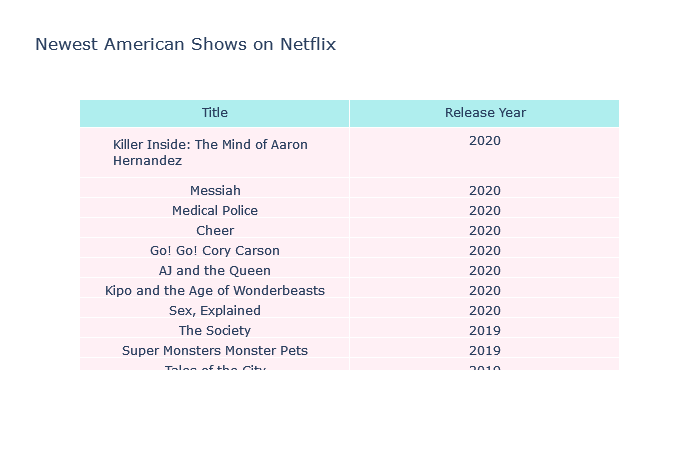

# Creating a Machine Learning-Based Recommendation System

---


---

## Author: Juan Carlos González
## E-mail: jcgi.laboral@gmail.com

---

## Date: February, 2024

---

## Content
1. Data Cleaning
2. Visualization and Analysis

-2.1 Movies and shows by released years
2.2 Countries with the most movies/shows
2.3 Casts with the most movies/shows
2.4 Movie Ratings
2.5 Movie Ratings in IMDb
2.6 Duration of Movies
2.7 Oldest/Newest Shows
2.8 Word Cloud

3. Machine Learning: Recommendation System
4. Conclusion

---

# Project Objective
Netflix's goal in creating a machine learning-based recommendation system is to maximize user engagement by delivering personalized content. The objective is to present each user with movies, TV shows, or documentaries they are most likely to enjoy, based on their preferences and past behaviors. This system is crucial for maintaining and growing Netflix's subscriber base by keeping users engaged for longer periods and reducing churn.

# Description of the method

Objectives of Netflix’s Recommendation System:
Maximizing User Satisfaction: Deliver personalized content that users are highly likely to enjoy to increase engagement and reduce churn.

Improving Content Discovery: Help users discover new shows or movies they may not have searched for but would enjoy, encouraging deeper exploration of Netflix's catalog.

Enhancing Retention: By continuously delivering relevant content, Netflix aims to reduce churn by making the platform indispensable to its users.

Optimizing for Long-Term Value: Rather than just focusing on short-term engagement, Netflix’s system aims to build long-term user loyalty by catering to evolving tastes and habits.

Methods Employed in the Recommendation System:
Netflix uses a combination of collaborative filtering, content-based filtering, and hybrid approaches to generate its recommendations.

## 1. Data Cleaning

```python
import pandas as pd
import numpy as np
pd.set_option('display.max_columns', None)
pd.set_option('display.max_rows', 100)
import plotly.express as px
import plotly.graph_objects as go
import matplotlib.pyplot as plt
from collections import Counter
from wordcloud import WordCloud, STOPWORDS, ImageColorGenerator

```


```python
netflix = pd.read_csv('netflix.csv')

```

```python
netflix.head(2)

```


```python
netflix.shape

```


```python
netflix.describe()

```


```python
netflix.columns

```


```python
netflix.dtypes

```


**Let's delete columns such as showid, description as we have index and do not need descriptions.**


```python
netflix.drop(columns=['show_id'], inplace=True)

```


**Then change data type for date added for the future use.**


```python
netflix['date_added'] = pd.to_datetime(netflix['date_added'])
movies = netflix.loc[netflix['type'] == 'Movie']
shows = netflix.loc[netflix['type'] == 'TV Show']

movies.drop(columns=['type'], inplace=True)
shows.drop(columns=['type'], inplace=True)

movies.reset_index(drop=True, inplace=True)
shows.reset_index(drop=True, inplace=True)

movies['duration'] = movies['duration'].str.replace('min', '')
movies['duration'] = movies['duration'].astype(int)

movies.head(2)
```


```python
shows.head(2)

```


## 2. Visualization

1. Movies and Shows by Release Year and Added Date

a. Movies and shows by release year

```python
movies_release_year = movies.groupby('release_year').count()['title'].to_frame()\
                .reset_index().rename(columns={'release_year':'Release Year', 'title':'Count'})
shows_release_year = shows.groupby('release_year').count()['title'].to_frame()\
                .reset_index().rename(columns={'release_year':'Release Year', 'title':'Count'})

fig = go.Figure()

fig.add_trace(go.Scatter(x=movies_release_year['Release Year'], y=movies_release_year['Count'],
                    mode='lines',
                    name='Movies'))
fig.add_trace(go.Scatter(x=shows_release_year['Release Year'], y=shows_release_year['Count'],
                    mode='lines',
                    name='Shows'))

fig.update_layout(template='none', title='Movies and Shows by Release Year',
                 width=950, height=500)
fig.update_yaxes(showgrid=False)
fig.update_xaxes(showgrid=False)

fig.show()

```


**Netflix carries most of the shows and movies released in 2000 to 2020. There is much less movies earlier than 1980.**

b. Movies and shows by added date


```python


movies['date_added'] = pd.to_datetime(movies['date_added'], errors='coerce').dt.strftime('%Y-%m')
shows['date_added'] = pd.to_datetime(shows['date_added'], errors='coerce').dt.strftime('%Y-%m')

movies_date_added = movies.groupby('date_added').count()['title']\
            .to_frame().reset_index().rename(columns = {'date_added':'Date Added', 'title':'Count'})
shows_date_added = shows.groupby('date_added').count()['title']\
            .to_frame().reset_index().rename(columns = {'date_added':'Date Added', 'title':'Count'})

fig = go.Figure()

fig.add_trace(go.Scatter(x=movies_date_added['Date Added'], y=movies_date_added['Count'],
                    mode='lines',
                    name='Movies'))
fig.add_trace(go.Scatter(x=shows_date_added['Date Added'], y=shows_date_added['Count'],
                    mode='lines',
                    name='Shows'))

fig.update_layout(template='none', title='Movies and Shows by Added Date',
                 width=950, height=500)
fig.update_yaxes(showgrid=False)
fig.update_xaxes(showgrid=False)

fig.show()

```


**Netflix added a lot of shows and movies from 2016. According to Netflix, it started streaming from 2007.**

2. Countries with the Most Movies and Shows


```python


netflix_country = netflix['country'].str.split(', ').explode()\
                .value_counts()[:15].to_frame().reset_index().rename(columns={'index':'Country', 'country':'Count'})

fig = px.scatter_geo(netflix_country, locations="Country", color="Count",
                     locationmode='country names', size_max=50,
                     hover_name="Country", size="Count",
                     projection="natural earth", color_continuous_scale=px.colors.diverging.BrBG,
                     title='Top 15 Countries with the Most Movies and Shows on Netflix')
fig.show()


```


a. Countries with the most movies

```python
movies_country = movies['country'].str.split(', ').explode().value_counts()[:15]\
            .to_frame().reset_index().rename(columns={'index':'Country', 'country':'Number of Movies'})

fig = px.scatter_geo(movies_country, locations="Country", color="Number of Movies",
                     locationmode='country names', size_max=50,
                     hover_name="Country", size="Number of Movies",
                     projection="natural earth", color_continuous_scale=px.colors.diverging.BrBG,
                     title='Top 15 Countries with the Most Movies on Netflix')


fig.show()

```


b. Countries with the most shows

```python


shows_country = shows['country'].str.split(', ').explode().value_counts()[:15]\
            .to_frame().reset_index().rename(columns={'index':'Country', 'country':'Number of Shows'})

fig = px.scatter_geo(shows_country, locations="Country", color="Number of Shows",
                     locationmode='country names', size_max=50,
                     hover_name="Country", size="Number of Shows",
                     projection="natural earth", color_continuous_scale=px.colors.diverging.BrBG,
                     title='Top 15 Countries with the Most Shows on Netflix')
fig.show()

```


**United States has the most shows and movies on Netflix, but also, Indian has the second most movies and shows, which I did not expect.**

3. Casts with the Most Movies and Shows on Netflix

a. Casts with the most movies

```python


movies_casts = movies['cast'].str.split(', ').explode().value_counts()[:10]\
            .to_frame().reset_index().rename(columns={'index':'Cast', 'cast':'Number of Movies'})

fig = px.bar(movies_casts, x="Number of Movies", y="Cast", color='Cast', orientation='h',
            template='none', width=900, height=400, color_discrete_sequence=px.colors.qualitative.Vivid,
            title='Top 15 Countries with the Most Movies on Netflix')
fig.update_layout(yaxis={'categoryorder':'total ascending'},
                  margin=dict(l=130, r=10, t=100))
fig.update_xaxes(showgrid=False)
fig.update_yaxes(showticklabels=True, title_text=None)
fig.show()

```


b. Casts with the most shows¶


```python


shows_casts = shows['cast'].str.split(', ').explode().value_counts()[:10]\
            .to_frame().reset_index().rename(columns={'index':'Cast', 'cast':'Number of Shows'})

fig = px.bar(shows_casts, x="Number of Shows", y="Cast", color='Cast', orientation='h',
            template='none', width=900, height=400, color_discrete_sequence=px.colors.qualitative.Vivid,
            title='Top 15 Countries with the Most Shows on Netflix')
fig.update_layout(yaxis={'categoryorder':'total ascending'},
                 margin=dict(l=130, r=10, t=100))
fig.update_xaxes(showgrid=False)
fig.update_yaxes(showticklabels=True, title_text=None)
fig.show()

```


**Although United States has the most shows and movies on Netflix, the cast with the most movies is Indian. Unlike U.S., it seems like there is less diversities in Indian movie industry. Additionally, the cast with the most shows is Japanese.**

4. Moving Ratings

```python
movie_ratings = movies.groupby('rating').count()['title'].sort_values(ascending=False)\
                .to_frame().reset_index().rename(columns = {'rating':'Rating', 'title':'Count'})

fig = px.pie(movie_ratings, values='Count', names='Rating', title='Netflix Movie Ratings',
            color_discrete_sequence=px.colors.sequential.RdBu)
fig.show()
```


**TV-MA and TV-14 is the most common ratings on Netflix.**

5. Best Rated Movies in Netflix using IMDb Ratings

```python


ratings = pd.read_csv('IMDb ratings.csv', usecols=['weighted_average_vote'])
movie_ratings = pd.read_csv('IMDb movies.csv', usecols=['title', 'year', 'genre'])
imdb = pd.DataFrame({'title':movie_ratings.title, 'release_year':movie_ratings.year,
                    'rating':ratings.weighted_average_vote, 'listed_in':movie_ratings.genre})
imdb.drop_duplicates(subset=['title','release_year','rating'], inplace=True)


movies_rated = movies.merge(imdb, on='title', how='inner')
movies_rated.drop(columns=['release_year_y', 'listed_in_y'], inplace=True)


movies_rated = movies_rated.rename(columns={'title': 'Title', 'director': 'Director', 'cast': 'Cast',
                             'date_added': 'Date Added', 'release_year_x': 'Release Year', 'country': 'Country',
                             'rating_x': 'TV Rating', 'duration': 'Duration',
                             'listed_in_x': 'Genre', 'rating_y':'Rating'})
top_10 = movies_rated.sort_values(by='Rating', ascending=False)[:10]

fig = px.sunburst(top_10, path=['Title','Country'], values='Rating', color='Rating',
                  color_continuous_scale='YlGn', title='Highst Rated Movies on Netflix in Each Countries',
                  hover_data=['Title', 'Country', 'Rating'])

fig.update_traces(hovertemplate='Title: %{customdata[0]} <br>Country: %{customdata[1]} <br>Rating: %{customdata[2]}')
fig.update_layout(legend_title_text='Rating')
fig.show()

```


6. Duration of Movies


```python
fig = px.histogram(movies, x='duration', nbins=22, template='none', 
                   title='Netflix Movie Duration')
fig.update_yaxes(showgrid=False)

fig.show()
```


**The most common durations for movies is from 80 to 90 minutes, but also it is common if the movies is a bit longer than that.**

7. Oldest/Newest Shows

```python
us_shows = shows.loc[shows['country'] == 'United States']
us_shows_old = us_shows.sort_values(by='release_year')[:15]
us_shows_new = us_shows.sort_values(by='release_year', ascending=False)[:15]

fig = go.Figure(data=[go.Table(header=dict(values=['Title', 'Release Year'], 
                                           fill_color='paleturquoise'), 
                               cells=dict(values=[us_shows_old['title'], us_shows_old['release_year']], 
                                          fill_color='lavender'))])
fig.update_layout(title='Oldest American Shows on Netflix')
fig.show()

```


```python
fig = go.Figure(data=[go.Table(header=dict(values=['Title', 'Release Year'], 
                                           fill_color='paleturquoise'), 
                               cells=dict(values=[us_shows_new['title'], us_shows_new['release_year']], 
                                          fill_color='lavenderblush'))])
fig.update_layout(title='Newest American Shows on Netflix')
fig.show()

```




8. Word Cloud

```python


genres = list(movies['listed_in'])
genre = []

for i in genres:
    i = list(i.split(','))
    for j in i:
        genre.append(j.replace(' ', ''))
gen = Counter(genre)


text = list(set(genre))
plt.rcParams['figure.figsize'] = (15, 10)
wordcloud = WordCloud(max_font_size=50, max_words=50,background_color="white").generate(str(text))

plt.imshow(wordcloud, interpolation="bilinear")
plt.axis("off")
plt.show()

```


**The most popular genre on Netflix are independent movie, thriller, standup comedy and classic movies. Also Children movies are quite popular, too.**

3. Machine Learning

- Recommendation System

I decided to learn about it. (by: Niharika Pandit https://www.kaggle.com/niharika41298/netflix-visualizations-recommendation-eda)


```python
from sklearn.feature_extraction.text import TfidfVectorizer

tfidf = TfidfVectorizer(stop_words='english')
netflix['description'] = netflix['description'].fillna('')
tfidf_matrix = tfidf.fit_transform(netflix['description'])
tfidf_matrix.shape

```


**There is over 16,000 words describe about 6,000 movies.**


```python


from sklearn.metrics.pairwise import linear_kernel
cosine_similarity = linear_kernel(tfidf_matrix, tfidf_matrix)
indices = pd.Series(netflix.index, index=netflix['title']).drop_duplicates()


def get_recommendations(title, cosine_sim=cosine_similarity):
    idx = indices[title]
    sim_scores = list(enumerate(cosine_sim[idx]))
    sim_scores = sorted(sim_scores, key=lambda x: x[1], reverse=True)
    sim_scores = sim_scores[1:11]

    movie_indices = [i[0] for i in sim_scores]

    return netflix['title'].iloc[movie_indices]

get_recommendations('Jane The Virgin')

```


## 4. Conclusion

As a person who watches Netflix regularly, this analysis was something that I expected, but also was surprised. For example, I did not know there were so many of Indian movies and shows, as I only watch shows and movies in english. Additionally, although Netflix started streaming from 2007, there were not many movies added at the time. Rather, a lot of movies were added later from 2015. This has been a fun analysis, and I'm looking towards watching more Netflix shows and movies!
